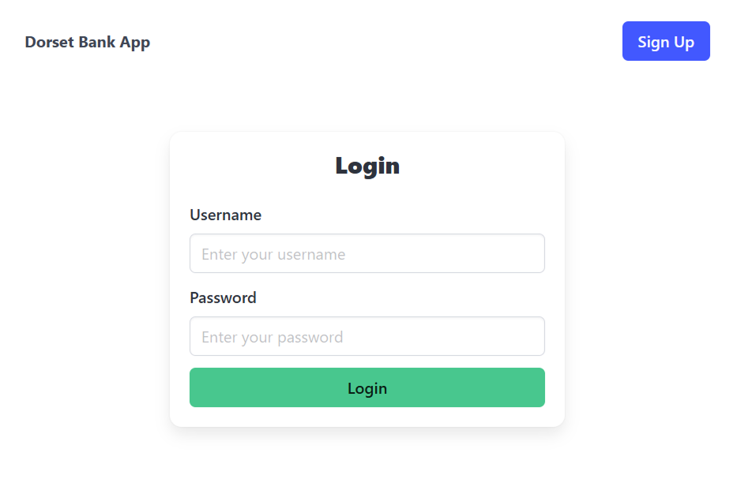
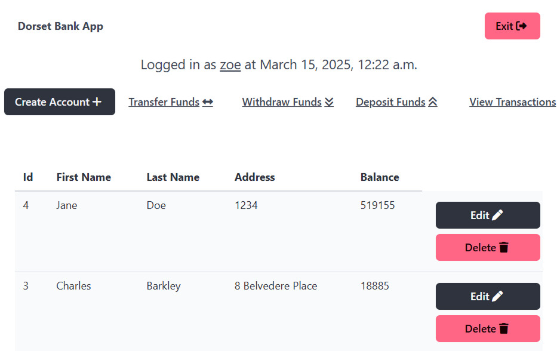
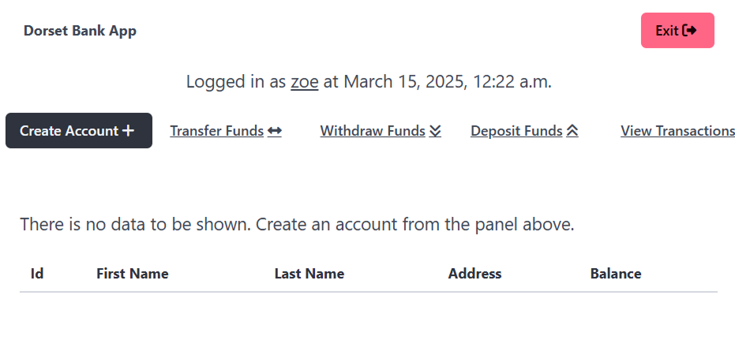
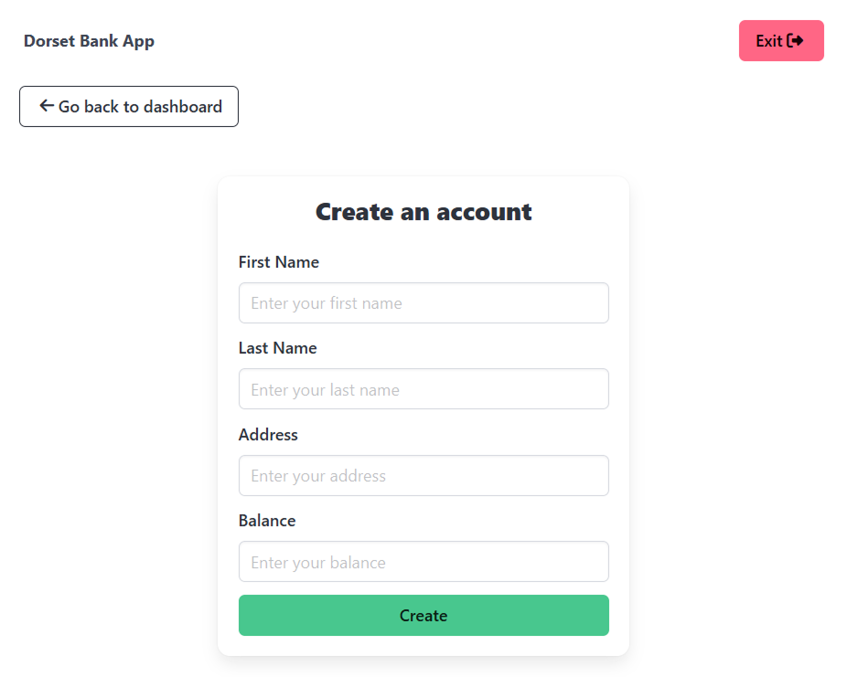
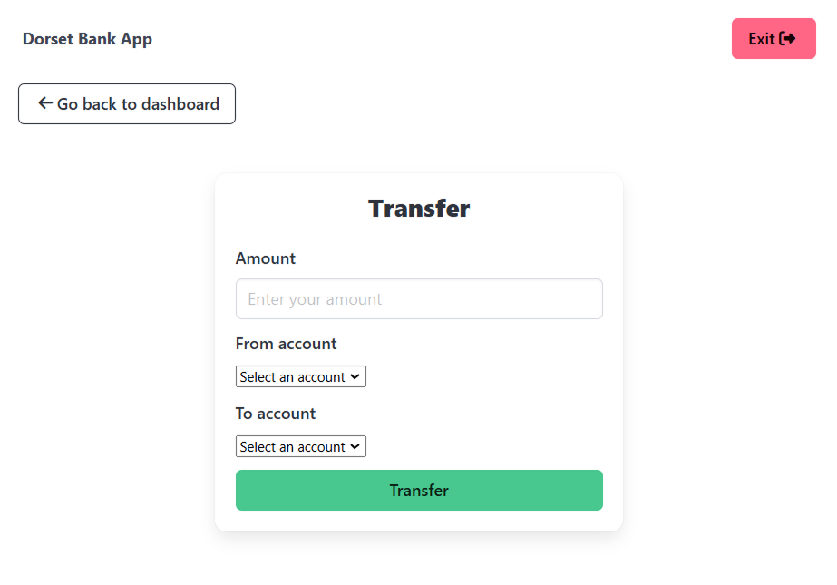
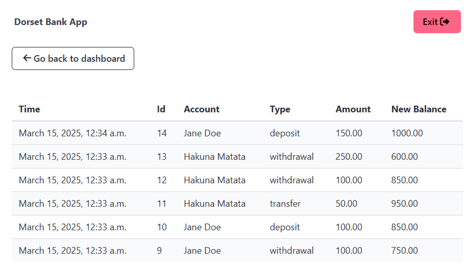

# Section 1

|Task Description|Marks|
|----------------|-----|
|Explain what a constructor is and when it is used in Python programming language? (5 marks) And give an example in code of this. (5 marks)|10 Marks|
|A constructor is the initialising function of a class, called ```__init__()```. This function creates an instance of the object with the parameters specified upon invokation. It takes in a number of arguments ```(self, *args, **kwargs)```.||
|```class Animal:
      def __init__(self, name, colour):
        self.name = name
        self.colour = colour```||
|When is inheritance used in OOP in Python? (6 marks) And give a code example (4 marks)|10 Marks|
|Define polymorphism (6 marks) and give a code example. (4 marks)|10 Marks|
|What is a structural pattern in Python. (6 marks) And give an example of the adaptor and decorator. (4 marks)|10 Marks|
|Define a name error in Python. (5 marks). Give a code example of a name error. (5 marks)|10 Marks|
|**Total:**|**100%**|


# Section 2

Dorset College has recently been issued with a banking license from the Central Bank. In order to facilitate the operation of Dorset Bank a bespoke software application will be required to be built. Dorset Bank has requested you to develop a prototype for an internal application which their staff will be able to use to perform basic banking tasks.
Using Python and Django create a Project folder. You will need to install Django in your folder. First create a virtual environment and then install Django. You can also add the MySQL Extension for VSC. You will need to create three tables. You can use tkinter forms for the GUI.
You can then add as many Python files as required in your project. And as many classes and functions as you require. Code must be written in Python with MySQL for the tables. The basic requirements are described in the following table.

|Requirement| Description|
|-----------|------------|
|REQ1|The desktop application must be built using Python VSC with a MySQL backend. In addition you will need to create three tables in MySQL – one for account data and one for the transactions one for login details. You will need to import the MySQL connector to your new project.|
|REQ2|When the application is launched, a user must be presented with a log in screen similar to that outlined in Figure 1 below.|
|REQ3|In order to ensure appropriate use of the application only internal staff maybe allowed use this software. As a result a user must login to the application. Figure 1 shows the desired layout of the login screen. The username and password can be displayed in clear text.  Figure 1 is shown when a user runs the program. If the user enters an incorrect username and/or password a message should appear informing them so. You will also need to add an input mask for the password so that asterisks replace the numbers or characters of the password when typed.|
|REQ4|Once a user has successfully logged into the application the menu context will change. The menu should now display the following:|
||<table><tr><td>Level 1</td><td>File</td><td>Edit</td></tr><tr><td>Level 2</td><td>Exit</td><td>Create Account</td></tr><tr><td></td><td></td><td>Delete Account</td></tr><tr><td></td><td></td><td>Edit Account</td></tr><tr><td></td><td></td><td>Transfer</td></tr><tr><td></td><td></td><td>Withdraw</td></tr><tr><td></td><td></td><td>Deposit</td></tr><tr><td></td><td></td><td>View Transactions</td></tr></table>|
||Figure 2 below illustrates the updated menu.|
|||
|REQ5|In addition to updating the menu upon a successfully login a grid should be displayed containing information relating to existing bank accounts. Figure 3 illustrates an example of how this should look.|
|||
||If no bank accounts exist then the grid should be empty. (i.e. contain no information)|
|REQ6|A user must be able to create a new account. To do this they select the “Create Account” menu item under “Account” from the menu bar. A screen similar to that shown in Figure 4 should be displayed. The following data must be captured:|
|||
||<table><tr><th>Name<th>Description<th>Data type<tr><td>First Name<td>The first name of the owner of the bank account<td>String<tr><td>Last Name<td>The surname of the owner of the bank account<td>String<tr><td>Id Number<td>The new account number for the account<td>Int (3 digits)<tr><td>Balance<td>The current balance in the account<td>Int</table>|
||When a new account has been successfully added to the system, the grid displaying all the accounts in the system should be updated to include the newly added account.|
|REQ7|The user of the application must be able to update/edit existing accounts. The screen to do this is similar to that shown in figure 4 with the following exception: The following fields should be read only. That is the user should not be able to modify the account balance using this screen.|
||Balance|
||Id number|
||All other fields should be pre-populated with the relevant data for the account being updated. As per REQ6, the grid displaying all accounts should be updated to reflect any changes in the account information.|
|REQ8|The user should be able to **deposit** and **withdraw** funds on behalf of the account (id) owner. A screen should be displayed where the user enters the amount of funds which has been requested to be deposited or withdrawn for a given account. Once a deposit or withdrawal has been made, the grid displaying all the accounts should be updated to reflect the change in the account’s balance.|
|REQ9|The user should be able to transfer funds from one id to another. The destination id (id which funds are being transferred to). The following data must be captured to perform this task|
||<table><tr><th>Name<th>Description<th>Data type<tr><td>Source id<td>The id of the account which the funds will be transferred from<td>Int (3 digits)<tr><td>Destination id<td>The id of the account which the funds will be deposited<td>Int (3 digits)<tr><td>Date/Time of transfer<td>A system date time when the transfer has taken place<td>DateTime</table>|
||It should be noted that funds must be debited from the source id. Figure 5 illustrates the suggested layout for this screen.|
|||
|REQ10|The system is expected to keep an audit of all funds entering and leaving an account id. Each time a deposit, withdrawal or transfer is made a transaction record should be recorded against all applicable accounts. The balance in the transactions table needs to reflect the current balance in relevant accounts and also in the accounts table. Figure 6 illustrates a suggested layout for the transactions associated with a particular account.|
|||

- [ ] (a) Create four accounts of test data to test your app. [5 marks]

- [x] (b) Implement the project above in Python. [45 marks]

### Notes:
- Assignment must be submitted to Moodle on or before the deadline stated.
- Failure to submit by the deadline will incur 10% penalty per day up to 5 days post submission date.
- Plagiarism software will automatically review your submission, please ensure you have used the Harvard Referencing system throughout your submission.
- Please ensure you use the Dorset College cover page including your name, student # and CA title.


